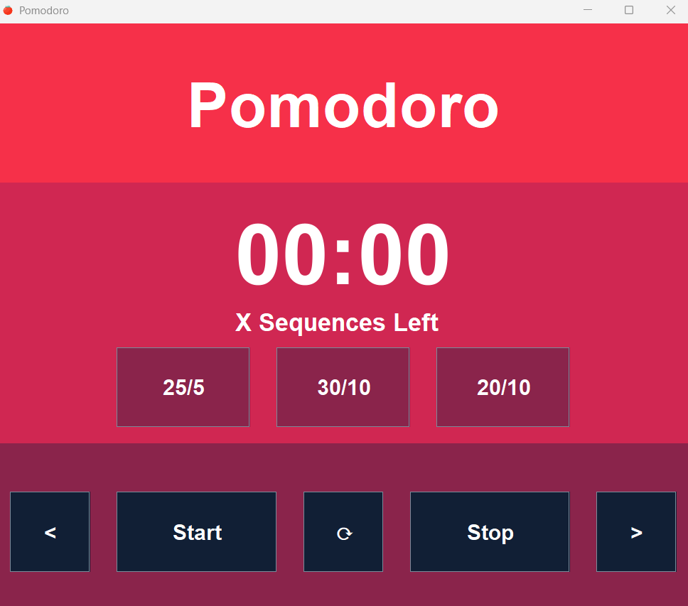

# Pomodoro Timer made in Java | Requires Java 17+

This project is a lightweight Pomodoro timer desktop application built in Java using the Swing GUI library. The application was originally created to help structure study sessions during final exams and has since become a regular productivity tool throughout my academic work. The goal of the project was to create a simple, distraction-free timer that encourages focused work sessions while also pacing study time with scheduled breaks.

The application features a fully custom graphical interface designed from the ground up using Java Swing. The visual layout and overall design were first planned in Canva before being recreated programmatically within the application. This application has 2 color themes, a warm and lighter tone. The timer includes multiple preset Pomodoro configurations, including 25/5, 20/10, and 30/10 work-to-break intervals. Users can start, stop, reset, and navigate between cycles using the provided controls. Once a work session ends, the program automatically transitions into the corresponding break period. The application also includes audio notifications.

By default, the timer runs through four sequences, which results in approximately one hour of combined work and break time before requiring a full reset. The program was intentionally designed to remain lightweight and responsive, making it suitable for running in the background during work or study sessions. A downloadable .jar file is included in this repository for quick setup and use.

If you don't have the latest versions of Java, you can download it here https://adoptium.net/ 

# Technical Explanation of how the timer works:
The timer system is built around a simple core concept: the remaining time is stored as an integer representing total seconds, which decreases once per second while the timer is active. While the underlying logic is straightforward, implementing the timer inside a Swing-based GUI introduced an important challenge due to Swing’s single-threaded, event-driven architecture.

A traditional loop-based timer implementation would block the Event Dispatch Thread (EDT), preventing the GUI from responding to user input while the timer was running. In practice, this would make actions such as stopping, resetting, or navigating between cycles impossible until the timer completely finished executing. The application needed a way to continuously update the timer every second while still allowing all other GUI events to remain responsive.

To solve this problem, the project separates responsibilities across three main components. PomodoroFrame handles all GUI rendering and user interaction, the custom Timer class stores and updates the timer state, and javax.swing.Timer (referred to in the project as JTimer) acts as the event-driven scheduler responsible for executing actions every 1000 milliseconds.

JTimer is the key component that allows the entire application to function correctly within Swing’s architecture. Rather than being used as the actual storage mechanism for the remaining time, JTimer is used as a repeating event trigger that constantly runs in the background once per second. Every time the scheduled event occurs, the application checks whether the timer is currently active. If the conditions are met, methods from the custom Timer class are executed to decrement the total remaining seconds, format the time into MM:SS, and update the GUI with the new values.

The important detail is that JTimer itself is not acting as the timer state manager. Its role is closer to serving as the equivalent of a scheduled Thread.sleep() call within an event-driven environment. Instead of locking the application inside a blocking loop, JTimer repeatedly performs lightweight checks and updates while allowing Swing to continue processing button presses and other GUI events in sequence. Because JTimer remains active in the background at all times, the application can immediately respond to actions such as start, stop, reset, forward, and backward cycle navigation without freezing the interface.

This design allowed the application to maintain full responsiveness without requiring manual thread management or introducing concurrency complexity. The custom Timer class handles all application-specific logic and timing data, while JTimer provides the scheduling mechanism that keeps the countdown synchronized with the graphical interface
